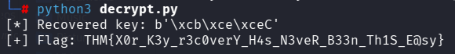

#TryHackMe: b1t_recovery -- Write-up & Solution

## Challenge OVerview
* **Platform:** TryHackMe
* **Objective:** Recover a private ledger file scrambled using a lightweight XOR encryption routine. 
* **Vulnerability:** Weak key space (4-byte key) combined with a known plaintext format. 

---

## Step-by-Step Walkthrough

### Step 1: Initial Analysis
Reviewing the provided `challenge.py` source script revealed how the encryption works. The script imports a random 4-byte key using `os.urandom(4)` and applies a symmetric XOR function to the flag data.


### Step 2: Exploiting the Symmetric XOR Property 
Because XOR is completely symmetric:
* \(\text{Ciphertext} = \text{Plaintext} \oplus \text{key}\)
* \(\text{key} = \text{Ciphertext} \oplus \text{Plaintext}\)

By analyzing `challenge.py`, we can explicitly see that `key = os.urandom(4)` generates a 4-byte key, and the target payload begins with `flag = b"THM{...". Because the source code provides us with the exact first 4 bytes of the plaintext ('THM{'), we can XOR them directly against the first 4 bytes of the ciphertext to extract the exact 4-byte key.

### Step 3: Executing the Custom Exploit Script
A custom Python script (`decrypt.py`) was written to automate the key extraction and file decryption:

```python
#Read the encrypted content
with open("encrypted.bin", "rb") as f:
    ciphertext = f.read()

#known plaintext prefix for TryHackMe flags (4 bytes)
known_prefix = b"THM{"

#Recover the 4-byte key by XORing the first 4 bytes of ciphertext with THM{
key = bytes([ciphertext[i] ^ known_prefix[i] for i in range(4)])
print(f"[*] Recovered key: {key}")

#Decrypt the entire ciphertext using the recovered 4-byte key
flag = bytes([ciphertext[i] ^ key[i % 4] for i in range(len(ciphertext))])
print(f"[+] Flag: {flag.decode(errors='ignore')}")
```

### Step 4: Target Decryption and Key Warning
To recover the real flag, the custom `decrypt.py` script must be executed directly against the unmodified `encrypted.bin` file provided by the challenge. 

**Critical Operational Warning:** Do not execute `challenge.py` within your working directory before running the decryption script. Running `challenge.py` will execute the encryption routine using the hardcoded fake flag (`THM{FAKE_FLAG_FOR_TESTING}`), permanently overwriting the original `encrypted.bin` file and destroying the real flag data.

Running the decryption script safely against the fresh target file yields the proper key and outputs the flag: 



---

### Remediation & Security Takeaways
1. **Never reuse a short XOR key:** If the key length is shorter than the message, attackers can easily break it using known plaintext or frequency analysis.
2. **Use Industry Standards:** Implement robust cryptographic configurations such as AES-GCM via trusted libraries like `cryptography` or `PyCryptodome`.
 


